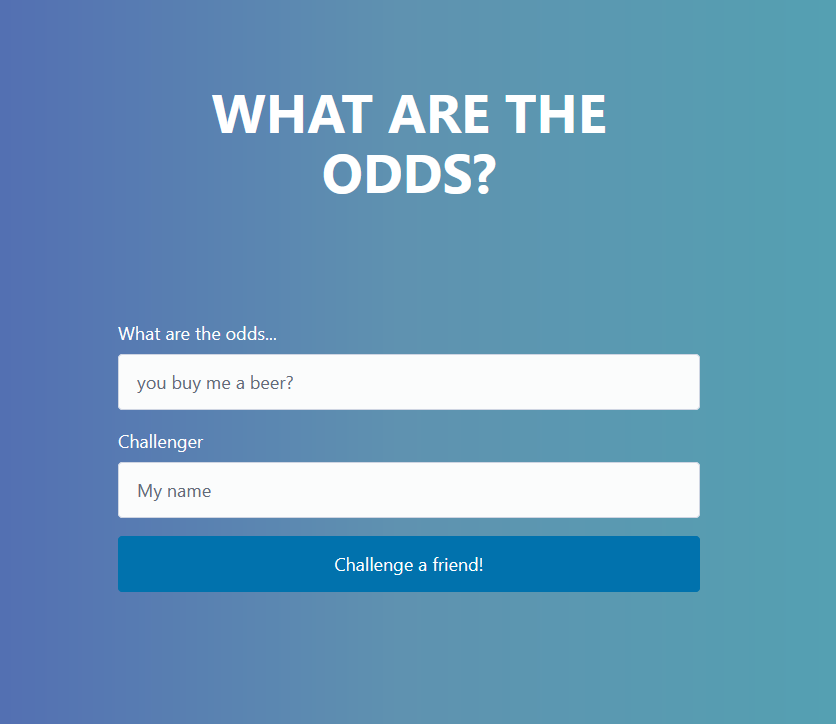
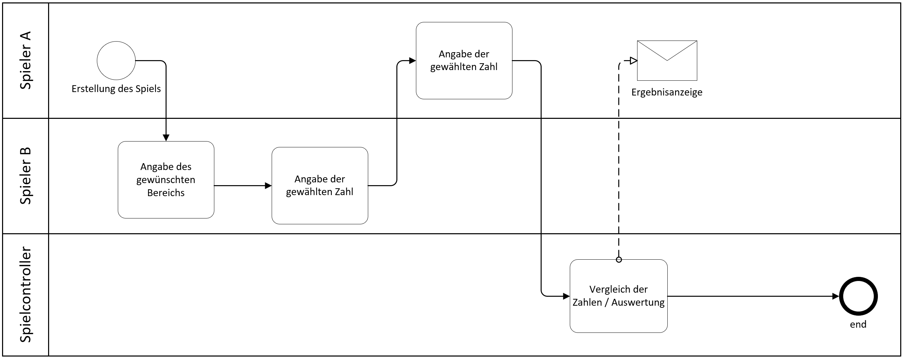
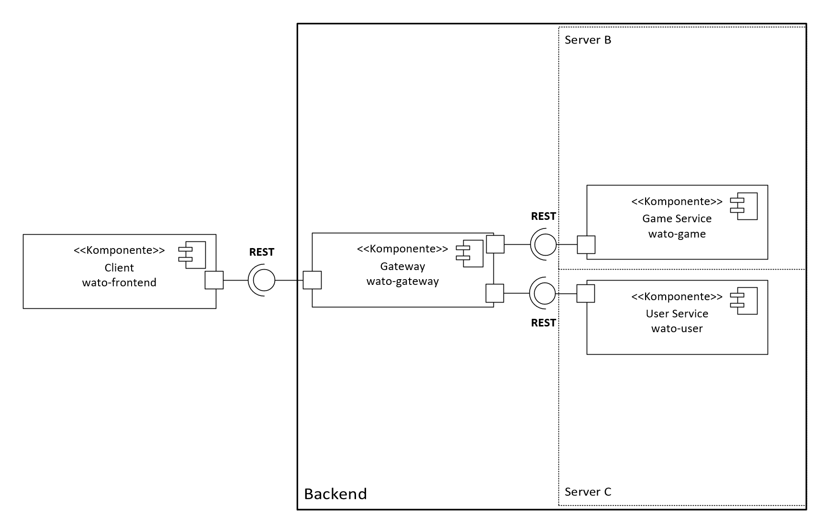
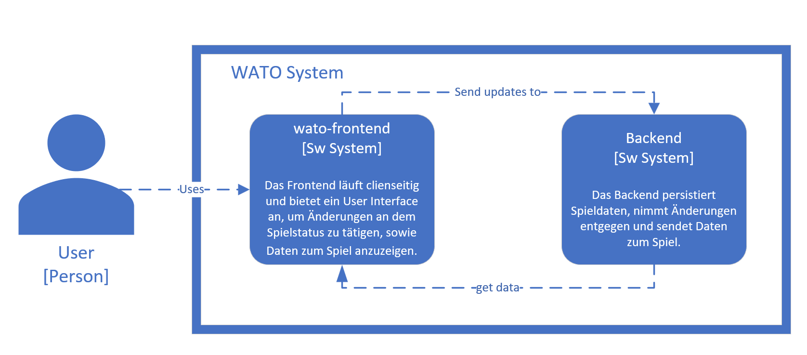
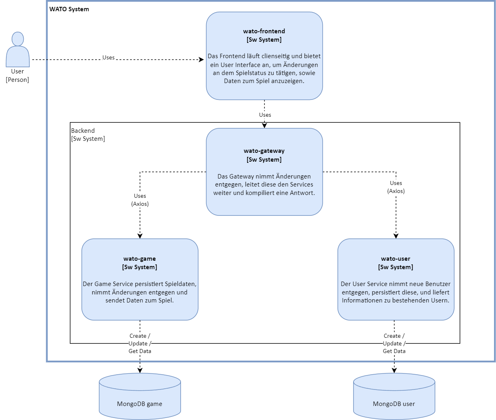
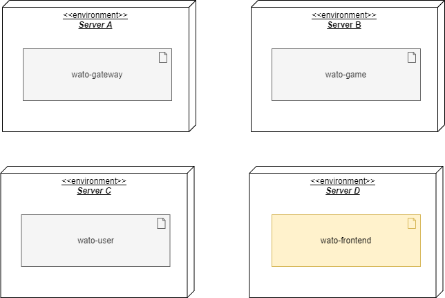
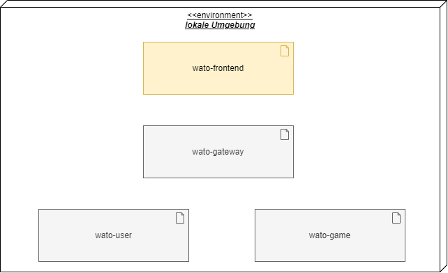

# Architekturdokumentation WATO

___
**Projektname**: WATO - What are the Odds

**Autor**: Samuel Nussbaumer

**Organisation**: HSLU - Hochschule Luzern

**Semester**: HS23
___

## Bestandteile der Software

- Frontend: [wato-frontend](https://github.com/snoozebaumer/wato-frontend)
- Backend:
  - Gateway: [wato-gateway](https://github.com/snoozebaumer/wato-gateway)
  - Game Service: [wato-game](https://github.com/snoozebaumer/wato-game)
  - User Service: [wato-user](https://github.com/snoozebaumer/wato-user)

## Einleitung und Zielsetzung

WATO setzt das Spiel [**What are the Odds?**](https://www.wikihow.com/Play-What-Are-the-Odds), zu Deutsch **Was sind die Chancen?**, oder in meinem Umfeld unter **Eis zu wievill?** bekannt, um. Das Spiel ist ein Partyspiel, bei dem zwei Spieler gegeneinander antreten.
Ein Spieler stellt dem anderen eine Aufgabe. Der Herausgeforderte gibt anhand seiner Bereitschaft, die Aufgabe zu erfüllen, eine Wahrscheinlichkeit an (Bsp. 1/100). Innerhalb dieses Wahrscheinlichkeitsbereichs
(Bsp. 1-100) nennen anschliessend beide Spieler gleichzeitig eine Zahl. Nennen Sie die gleiche Zahl, so muss der Herausgeforderte die Aufgabe erfüllen. Nennen sie unterschiedliche Zahlen, passiert nichts.

Da die Zahlen gleichzeitig genannt werden, ist das Spiel online nicht ohne weiteres spielbar. Deshalb wird eine Webapplikation entwickelt, welche das Spiel asynchron ermöglicht.
Dabei soll es für einen Spieler nicht möglich sein, die Zahl, die das gegenüber genannt hat, zu sehen, bevor er seine eigene genannt hat.

### Ablauf
Der generelle (vereinfachte) Ablauf des asynchronen Spiels sollte folgendermassen aussehen:

[Bild in Vollauflösung](img/wato-ablauf.png)

## Lösungsstrategie

[Bild in Vollauflösung](img/wato-components.png)

Die Webapplikation besteht aus einem Frontend und einem Backend. 
- Das Frontend ist in Angular umgesetzt, das Backend in Node.js.
- Das Backend besteht aus einem Gateway und den zwei Microservices _wato-game_ und _wato-user_, welche ihre Daten in je einer externen MongoDB persistieren. 
- Die Microservices sind in sich geschlossen und kommunizieren nur über das Gateway mit dem Frontend. So könnte, falls die Applikation erweitert wird, beispielsweise mit einem AuthService, dieser einfach hinzugefügt werden, ohne dass die anderen Services davon betroffen sind.
Dies bewirkt, dass die Microservices so in ihrer Technologie offen sind, sie könnten also auch in Java geschrieben werden. Der einfacheren Umsetzung wegen wird jedoch hier auf eine einheitliche Technologie gesetzt.
- Die Kommunikation zwischen Frontend und Backend, sowie Gateway und Microservices erfolgt über REST.

### API-Dokumentation
#### Gateway (Öffentlich)

| # | Endpoint                                               | Method | Description                                                                                | Request Body                                                                                      | Response Body                                                                                                                                                                                                                                                                                                              |
|---|--------------------------------------------------------| ------ |--------------------------------------------------------------------------------------------|---------------------------------------------------------------------------------------------------|----------------------------------------------------------------------------------------------------------------------------------------------------------------------------------------------------------------------------------------------------------------------------------------------------------------------------|
| 1 | `/`                                                    | GET    | Get API Status                                                                             | -                                                                                                 | "wato API is running."                                                                                                                                                                                                                                                                                                     |
| 2 | `/api/challenges`                                      | POST   | Create Challenge                                                                           | `challenge` (string, required) `name` (string, required) `challengeStatus` (enum, required) | `id` (string)                                                                                                                                                                                                                                                                                                              |
| 3 | `/api/challenges/:id` param: `id`(string, required) | GET    | Get Challenge by ID                                                                        | -                                                                                                 | `id` (string) `challenge` (string) `challengerId` (string) `challengerName` (string) `challengeeId` (string, optional) `challengeeName` (string, optional) `challengeStatus` (string) `maxRange` (number, optional) `challengerNumber` (number, optional) `challengeeNumber` (number, optional) |
| 4 | `/api/challenges/:id` param: `id`(string, required)                                  | PUT    |  Set Game number range for challenge by ID **Prerequisite:**  challengeStatus: NEW | `maxRange` (number, required) `challengeeName` (string, required)                                                                     | `id` (string) `challengerId` (string) `challengerName` (string) `challengeeId` (string, optional) `challengeeName` (string, optional) `challengeStatus` (string) `maxRange` (number, optional) `challengerNumber` (number, optional) `challengeeNumber` (number, optional)                         |
| 5 | `/api/challenges/:id` param: `id`(string, required)                                  | PUT    | Update Challenge by ID **Prerequisite:**  challengeStatus: GUESS_TO_BE_SET                                        | `challengeeNumber` (number, required)                      | `id` (string) `challengerId` (string) `challengerName` (string) `challengeeId` (string, optional) `challengeeName` (string, optional) `challengeStatus` (string) `maxRange` (number, optional) `challengerNumber` (number, optional) `challengeeNumber` (number, optional)                         |
| 6 | `/api/challenges/:id` param: `id`(string, required)                                  | PUT    | Update Challenge by ID   **Prerequisite:**  challengeStatus: CHALLENGER_TO_MOVE                                     | `challengerNumber` (number, required)                                                             | `id` (string) `challengerId` (string) `challengerName` (string) `challengeeId` (string, optional) `challengeeName` (string, optional) `challengeStatus` (string) `maxRange` (number, optional) `challengerNumber` (number, optional) `challengeeNumber` (number, optional)                         |
| 7 | `/api/user`                                            | GET    | Get Currently Logged in User                                                               | -                                                                                                 | `id` (string) `name` (string)                                                                                                                                                                                                                                                                                           |

#### Game Service (Intern)

| #   | Endpoint                                               | Method | Description                                                | Request Body                                                           | Response Body                                                                                                                                                                                                                                          |
| --- | ------------------------------------------------------ | ------ | ---------------------------------------------------------- | ----------------------------------------------------------------------- |--------------------------------------------------------------------------------------------------------------------------------------------------------------------------------------------------------------------------------------------------------|
| 1   | `/game`                                                | POST   | Create Challenge                                           | `challenge` (object, required): Challenge object with necessary properties | `id` (string)                                                                                                                                                                                                                                          |
| 2   | `/game/:id` param: `id`(string, required)           | GET    | Get Challenge by ID                                        | -                                                                     | `id` (string) `challengerId` (string) `challenge` (string) `challengeeId` (string, optional) `challengeStatus` (string) `maxRange` (number, optional) `challengeeNumber` (number, optional) `challengerNumber` (number, optional) |
| 3   | `/game/:id` param: `id`(string, required)           | PUT    | Set Game number range for challenge by ID **Prerequisite:**  challengeStatus: NEW | `maxRange` (number, required) `challengeeName` (string, required)                                         | `id` (string) `challengerId` (string) `challenge` (string) `challengeeId` (string) `challengeStatus` (string) `maxRange` (number)                                                                                                       |
| 4   | `/game/:id` param: `id`(string, required)           | PUT    | Update Challenge by ID **Prerequisite:**  challengeStatus: GUESS_TO_BE_SET | `challengeeNumber` (number, required) | `id` (string) `challengerId` (string) `challenge` (string) `challengeeId` (string) `challengeStatus` (string) `maxRange` (number) `challengeeNumber` (number)                                                                        |
| 5   | `/game/:id` param: `id`(string, required)           | PUT    | Update Challenge by ID **Prerequisite:**  challengeStatus: CHALLENGER_TO_MOVE | `challengerNumber` (number, required)                                 | `id` (string) `challengerId` (string) `challenge` (string) `challengeeId` (string) `challengeStatus` (string) `maxRange` (number) `challengeeNumber` (number) `challengerNumber` (number)                                         |

#### User Service (Intern)
| #   | Endpoint                  | Method | Description         | Request Body          | Response Body       |
| --- | ------------------------- | ------ | ------------------- | --------------------- | ------------------- |
| 1   | `/user`                   | POST   | Create User          | `name` (string, required) | `id` (string)       |
| 2   | `/user/:id` param: `id`(string, required) | GET    | Get User by ID       | -                     | `id` (string) `name` (string) |

## Bausteinsicht

### Ebene 1

[Bild in Vollauflösung](img/ebene-1.png)

Der Benutzer interagiert mit dem Frontend. Füllt der Benutzer ein Formular aus und sendet es ab, wird das Update an das Backend gesendet.
Das Backend verarbeitet die Anfrage und gibt das Resultat zurück. Das Frontend zeigt das Resultat an.
### Ebene 2

[Bild in Vollauflösung](img/ebene-2.png)

Der User kommuniziert über Interaktionen mit dem Frontend (Formular ausfüllen / Challenge aufrufen) mit dem Gateway. Das Gateway leitet die Anfrage an die entsprechenden Microservices weiter. Die Microservices verarbeiten die Anfrage und geben das Resultat zurück. Das Gateway leitet das Resultat an das Frontend weiter.
Für genauere Informationen dazu, welche Requests bei welchen Systemen aufrufbar sind, siehe [API-Dokumentation](#api-dokumentation).
## Laufzeitsicht
### Spiel erstellen

### Spiel aufrufen

### Spielbereich bestimmen

### Zahl auswählen

### Spiel fertigstellen

## Verteilung
Bei einem produktiven Deployment wäre folgende Verteilung geplant:

Dabei würde das Frontend mittels `ng build` gebaut und auf einem Webserver deployed. das Gateway und die Microservices werden mittels Docker containerized und auf je einem Server abgelegt.

Effektiv wird jedoch nur lokal deployed: Es laufen also das Frontend, das Gateway, sowie alle Services auf derselben Maschine:

## Querschnittliche Konzepte
### Internationalisierung i18n

### Teststrategie

### Persistenz

### Sessionhandling

### Skalierung

### Logging

## Entwurfsentscheidungen
### Technologien

### Microservice-Architektur

## Qualitätsanforderungen
| # | Qualitätsanforderung | Beschreibung                                                                                                                                                                                                             | Massnahmen               |
|---|----------------------|--------------------------------------------------------------------------------------------------------------------------------------------------------------------------------------------------------------------------|--------------------------|
| 1 | Performance          | "What are the Odds" soll innert 1s geladen werden.                                                                                                                                                                       | - (bereits erreicht)     |
| 2 | Skalierbarkeit       | Die Applikation soll auf 1000 Benutzer skalierbar sein.                                                                                                                                                                  | Microservice-Architektur |
| 3 | Usability            | Es wird erwartet, dass die Spiel-URLs oft per Mobile Chat versendet werden. Das Produkt soll also sowohl für die Desktop- als auch für die mobile Anzeige optimiert sein.                                                | Responsive Design        |
| 4 | Sicherheit           | Die Spielstatusänderungen, sowie die Spiel-ID sollen gemeinsam mit der «verursachenden» IP und einem Timestamp geloggt werden. Dies zur Ermöglichung einer zukünftigen Datenanalyse oder Verhinderung einer Spamattacke. | Logging im Backend       |

## Technische Schulden und Risiken
