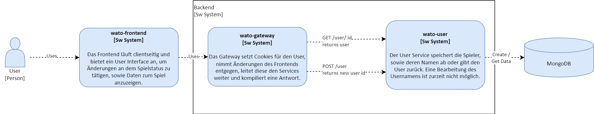

# What are the Odds?
## Einleitung

WATO setzt das Spiel [**What are the Odds?**](https://www.wikihow.com/Play-What-Are-the-Odds), zu Deutsch **Was sind die Chancen?**, oder in meinem Umfeld unter **Eis zu wievill?** bekannt, um. Die Webapp ist je nach Browsereinstellungen auf Englisch, Deutsch und Schweizerdeutsch verfügbar. Das Spiel ist ein Partyspiel, bei dem zwei Spieler gegeneinander antreten.
Ein Spieler stellt dem anderen eine Aufgabe. Der Herausgeforderte gibt anhand seiner Bereitschaft, die Aufgabe zu erfüllen, eine Wahrscheinlichkeit an (Bsp. 1/100). Innerhalb dieses Wahrscheinlichkeitsbereichs
(Bsp. 1-100) nennen anschliessend beide Spieler gleichzeitig eine Zahl. Nennen Sie die gleiche Zahl, so muss der Herausgeforderte die Aufgabe erfüllen. Nennen sie unterschiedliche Zahlen, passiert nichts.

Da die Zahlen gleichzeitig genannt werden, ist das Spiel online nicht ohne weiteres spielbar. Deshalb wird eine Webapplikation entwickelt, welche das Spiel asynchron ermöglicht.
Dabei soll es für einen Spieler nicht möglich sein, die Zahl, die das gegenüber genannt hat, zu sehen, bevor er seine eigene genannt hat.

Die Projektidee wurde inspiriert durch [EisZu](https://capso-789ce.web.app/) von [Jonas Wyss](https://github.com/jonas99y/).

## Bestandteile der Software

- Frontend: [wato-frontend](wato-frontend)
- Backend:
  - Gateway: [wato-gateway](wato-gateway)
  - Game Service: [wato-game](wato-game)
  - User Service: [wato-user](wato-user)

## Inhaltsverzeichnis
1. [Ablauf](#ablauf)
2. [Lösungsstrategie](#lösungsstrategie)
3. [API-Dokumentation](#api-dokumentation)
4. [Bausteinsicht](#bausteinsicht)
   1. [Ebene 1](#ebene-1)
   2. [Ebene 2](#ebene-2)
   3. [Ebene 3](#ebene-3)
5. [Laufzeitsicht](#laufzeitsicht).
   1. [Spielstatusübersicht](#spielstatusübersicht)
   2. [Seite aufrufen (Momentanen User laden)](#seite-aufrufen-momentanen-user-laden)
   3. [Spiel erstellen](#spiel-erstellen)
   4. [Spiel aufrufen](#spiel-aufrufen)
   5. [Spielbereich bestimmen](#spielbereich-bestimmen)
   6. [Zahl auswählen](#zahl-auswählen)
   7. [Spiel fertigstellen](#spiel-fertigstellen)
6. [Verteilung](#verteilung)
7. [Querschnittliche Konzepte](#querschnittliche-konzepte)
   1. [Internationalisierung i18n](#internationalisierung-i18n)
   2. [Teststrategie](#teststrategie)
   3. [Persistenz](#persistenz)
   4. [Sessionhandling](#sessionhandling)
   5. [Skalierung](#skalierung)
   6. [Logging](#logging)
8. [Entwurfsentscheidungen](#entwurfsentscheidungen)
   1. [Technologien](#technologien)
   2. [Microservice-Architektur](#microservice-architektur)
9. [Qualitätsanforderungen](#qualitätsanforderungen)
10. [Technische Schulden und Risiken](#technische-schulden-und-risiken)

## Ablauf
Der generelle (vereinfachte) Ablauf des asynchronen Spiels sollte folgendermassen aussehen:

[Bild in Vollauflösung](docs/img/wato-ablauf.png)

## Lösungsstrategie

[Bild in Vollauflösung](docs/img/wato-components.png)

Die Webapplikation besteht aus einem Frontend und einem Backend. 
- Das Frontend ist in Angular umgesetzt, das Backend in Node.js.
- Das Backend besteht aus einem Gateway und den zwei Microservices _wato-game_ und _wato-user_, welche ihre Daten in je einer externen MongoDB persistieren. 
- Die Microservices sind in sich geschlossen und kommunizieren nur über das Gateway mit dem Frontend. So könnte, falls die Applikation erweitert wird, beispielsweise mit einem AuthService, dieser einfach hinzugefügt werden, ohne dass die anderen Services davon betroffen sind.
Dies bewirkt, dass die Microservices so in ihrer Technologie offen sind, sie könnten also auch in Java geschrieben werden. Der einfacheren Umsetzung wegen wird jedoch hier auf eine einheitliche Technologie gesetzt.
- Die Kommunikation zwischen Frontend und Backend, sowie Gateway und Microservices erfolgt über REST.

### API-Dokumentation

Für die möglichen Requests und Responses zu den entsprechenden Repositories navigieren:
- Gateway: [wato-gateway](wato-gateway/README.md#api-documentation)
- Game Service: [wato-game](wato-game/README.md#api-documentation)
- User Service: [wato-user](wato-user/README.md#api-documentation)

## Bausteinsicht

### Ebene 1
In Ebene 1 wird die Kommunikation zwischen Frontend und Backend dargestellt. Das Backend wird dabei als Blackbox betrachtet.

[Bild in Vollauflösung](docs/img/ebene-1.png)

Der Benutzer interagiert mit dem Frontend. Füllt der Benutzer ein Formular aus und sendet es ab, wird das Update an das Backend gesendet.
Das Backend verarbeitet die Anfrage und gibt das Resultat zurück. Das Frontend zeigt das Resultat an.
### Ebene 2
In Ebene 2 wird das gesamte Backend in seine Bestandteile aufgeteilt. Das Gateway ist die einzige Schnittstelle zum Frontend.

[Bild in Vollauflösung](docs/img/ebene-2.png)

Der User kommuniziert über Interaktionen mit dem Frontend (Formular ausfüllen / Challenge aufrufen) mit dem Gateway. Das Gateway leitet die Anfrage an die entsprechenden Microservices weiter. Die Microservices verarbeiten die Anfrage und geben das Resultat zurück. Das Gateway leitet das Resultat an das Frontend weiter.
Für genauere Informationen dazu, welche Requests bei welchen Systemen aufrufbar sind, siehe [API-Dokumentation](#api-dokumentation).
### Ebene 3
In Ebene 3 werden die konkreten Endpunkte, welche aufgerufen werden, dargestellt. Dabei teilen wir in die Requests auf das Gateay und die Requests auf die Microservices auf.

#### Frontend

[Bild in Vollauflösung](docs/img/ebene-3-frontend.png)

#### Game Service

[Bild in Vollauflösung](docs/img/ebene-3-game.png)

#### User Service

[Bild in Vollauflösung](docs/img/ebene-3-user.png)

Das Gateway speichert ein Cookie für den User, welches die UserID enthält. Dieses Cookie wird bei jeder Anfrage an das Backend mitgeschickt.
Das Gateway liest das Cookie bei einer Anfrage wieder aus und leitet bei GET/user/:id die darin enthaltene UserID an den User-Service weiter.

## Laufzeitsicht
Alle Formulareingaben sind required und werden sowohl Client- als auch Serverseitig geprüft. Die Prüfung wird jedoch jeweils zur Kürzung der Diagramme ausgelassen.

### Spielstatusübersicht
Über den Verlauf des Spiels kann das Spiel in verschiedenen Status sein. Die folgende Tabelle zeigt die verschiedenen Status und die dazugehörigen Aktionen, welche in diesem Status möglich sind.

| Status                  | Beschreibung                                                                                        | Bearbeitbare Felder | Berechtigte Rollen     | Nächster Status         |
|-------------------------|-----------------------------------------------------------------------------------------------------|----------------------|------------------------|-------------------------|
| NEW                     | Challenge mit Herausforderer und Challengebeschreibung erstellt, Zahlenbereich muss noch gesetzt werden | maxRange, challengeeName | alle Personen mit Link | GUESS_TO_BE_SET         |
| GUESS_TO_BE_SET         | Herausgeforderte Person und Zahlenbereich gesetzt. Herausgeforderter muss noch Zahl setzen | challengeeNumber | Herausgeforderter      | CHALLENGER_TO_MOVE      |
| CHALLENGER_TO_MOVE      | Herausgeforderter hat Zahl gesetzt, Herausforderer muss noch Zahl setzen                            | challengerNumber | Herausforderer         | CHALLENGE_SUCCESS / CHALLENGE_FAILURE      |
| CHALLENGE_SUCCESS       | Beide Spieler haben die gleiche Zahl genannt                                                        | - | alle Personen mit Link | -                       |
| CHALLENGE_FAILURE       | Beide Spieler haben unterschiedliche Zahlen genannt                                                 | - | alle Personen mit Link | -                       |

### Seite aufrufen (Momentanen User laden)

[Bild in Vollauflösung](docs/img/laufzeit-user-laden.png)

Ruft der User die Seite auf, wird zuallererst ein im AppModule definierter APP_Initializer ausgelöst, welcher über den UserService den momentanen User lädt.
Im Gateway wird geprüft, ob mit dem Request ein Cookie mitgeschickt wurde. Falls ja, wird die UserID aus dem Cookie ausgelesen und an den wato-user Service weitergeleitet, welcher den User aus der Datenbank lädt und zurückgibt.
Der User wird im Frontend im UserService abgespeichert und kann so von jeder Komponente, die den Service einbindet aus abgerufen werden, ChallengeCreateComponent braucht diesen beispielsweise, um den Namen des Herausforderers bereits vorzubefüllen.
Falls kein Cookie mit dem Request mitgeschickt wurde, wird vom Frontend eine 404-Fehlermeldung zurückgegeben und der User im UserService bleibt undefined. Erst nach Erfüllung dieser Anfrage werden die Komponenten geladen.

### Spiel erstellen

[Bild in Vollauflösung](docs/img/laufzeit-spiel-erstellen.png)

Nachdem das Formular zur Erstellung der Challenge ausgefüllt und der "Freund herausfordern"-Knopf gedrückt wurde, wird die Challenge vom ChallengeService mit dem Status NEW an das Gateway gesendet.
Das Gateway liest das Cookie "id" aus. Falls der User bereits mit der Webseite interagiert hat, wird dieses gesetzt sein. Falls nicht, wird über den wato-user Service ein neuer User angelegt und das Cookie gesetzt.
Mit der Id des Users als ChallengerId, entweder vom Cookie oder direkt von der Antwort des wato-user Services, wird die Challenge an den wato-game Service weitergeleitet, welcher die Challenge in der Datenbank speichert und die challengeId zurückgibt.
Die challengeId wird bis zur ChallengeCreationComponent zurückgegeben, welche mit dieser die ShareComponent aufruft. Die ShareComponent zeigt dem User den URL an, welche dieser an seinen Freund (Herausgeforderte Person) senden kann.

### Spiel aufrufen

[Bild in Vollauflösung](docs/img/laufzeit-spiel-aufrufen.png)

Wird /challenge/:id aufgerufen, wird die ChallengeId aus der URL ausgelesen und über ChallengeService an das Gateway weitergeleitet. Das Gateway leitet die Anfrage an den wato-game Service weiter, welcher die Challenge aus der Datenbank lädt und zurückgibt.
Falls der challengeStatus nicht SUCCESS oder FAILURE ist, also das Spiel nicht fertig ist, wird aus der Challenge die challengerNumber, sowie die challengeeNumber, also die Nummern, welche die Spieler wählen, herausgelöscht, um zu verhindern, dass ein Spieler die Zahl eines anderen auslesen kann.
Danach werden anhand der Ids die Namen der Spieler geladen und die Challenge an den ChallengeService zurückgegeben, welcher sie an die ChallengeDetailComponent weiterleitet.
Schliesslich prüft die ChallengeDetailComponent, ob der momentane User überhaupt berechtigt ist, die Challenge beim momentanen ChallengeStatus zu sehen. Falls nicht, wird auf die ShareComponent mit der Id des Spiels weitergeleitet.
Zur Vereinfachung im Diagramm nicht abgebildet, da nicht wesentlich, wird am Schluss, falls die Challenge den Status NEW hat noch der User aus dem UserService geladen, um den Namen der Herausgeforderten Person im Formular bereits zu setzen. Dies nur, falls der User bereits mit der Webseite interagiert hat.
### Spielbereich bestimmen

[Bild in Vollauflösung](docs/img/laufzeit-spielbereich-bestimmen.png)

Wird der Zahlenbereich gesetzt, wird die Änderung an den ChallengeService übergeben, welcher die Challenge an das Gateway weiterleitet. Das Gateway liest das Cookie "id" aus. Falls der User bereits mit der Webseite interagiert hat, wird dieses gesetzt sein. Falls nicht, wird über den wato-user Service ein neuer User angelegt und das Cookie gesetzt.
Mit der Id des Users als ChallengeeId, entweder vom Cookie oder direkt von der Antwort des wato-user Services, wird die Challenge an den wato-game Service weitergeleitet. Im wato-game Service wird der neue Status GUESS_TO_BE_SET gesetzt und die Challenge in der Datenbank aktualisiert. Die Datenbank gibt dabei das geänderte Challenge-Objekt zurück, welches ans Gateway weitergeleitet wird.
Im Gateway werden die Namen der Spieler vom User Service geladen und die Challenge an den ChallengeService zurückgegeben, welcher das UI der bearbeiteten Challenge entsprechend aktualisiert (Formular wird zu Zahlenauswahl geändert).

### Zahl auswählen

[Bild in Vollauflösung](docs/img/laufzeit-zahl-auswaehlen.png)

Wird die Zahl gesetzt, wird die Änderung an den ChallengeService übergeben, welcher die Challenge an das Gateway weiterleitet. Das Gateway sendet die Challenge an den wato-game Service weiter - ohne ein Cookie auszulesen - welcher die Challenge in der Datenbank aktualisiert. Die Datenbank gibt dabei das geänderte Challenge-Objekt zurück, welches ans Gateway weitergeleitet wird.
Im Gateway werden die Namen der Spieler noch vom User Service geladen und die Challenge über den ChallengeService der ChallengeDetailComponent zurückgegeben, welche auf die ShareComponent weiterleitet, da das Spiel nun vom Herausforderer fertiggestellt werden muss.
   

### Spiel fertigstellen

[Bild in Vollauflösung](docs/img/laufzeit-spiel-fertigstellen.png)

Wird die Zahl auch vom Herausforderer gesetzt, wird die Änderung an den ChallengeService übergeben, welcher die Challenge an das Gateway weiterleitet. Das Gateway sendet die Challenge an den wato-game Service weiter, welche die Challenge aus der Datenbank holt. 
Dort wird die Zahl des Herausforderers mit der Zahl des Herausgeforderten verglichen und basierend darauf der Status auf SUCCESS oder FAILURE gesetzt. Anschliessend wird die Challenge in der Datenbank aktualisiert. Die Datenbank gibt dabei das geänderte Challenge-Objekt zurück, welches ans Gateway weitergeleitet wird.
Im Gateway werden die Namen der Spieler vom User Service geladen und die Challenge über den ChallengeService der ChallengeDetailComponent zurückgegeben, welche das UI entsprechend aktualisiert. Das Spiel ist beendet.

## Verteilung
Bei einem produktiven Deployment wäre folgende Verteilung geplant:

[Bild in Vollauflösung](docs/img/wato-deployment.png)

Dabei würde das Frontend mittels `ng build` gebaut und auf einem Webserver deployed. das Gateway und die Microservices werden mittels Docker containerized und auf je einem Server abgelegt.

Effektiv wird jedoch nur lokal deployed: Es laufen also das Frontend, das Gateway, sowie alle Services auf derselben Maschine. Das Backend (wato-gateway, wato-user, wato-game) wird mittels Docker-Compose gestartet. Das Frontend wird mittels `ng serve` gestartet. Das Frontend kommuniziert mit dem Gateway über die Adresse `127.0.0.1:8080`.

[Bild in Vollauflösung](docs/img/wato-local-deployment.png)

## Querschnittliche Konzepte
### Internationalisierung i18n
Die Applikation wird im Frontend mittels ngx-translate internationalisiert. Die Texte werden in einer JSON-Datei gespeichert und je nach Sprache geladen.
Zurzeit ist es nicht möglich, die Sprache zu wechseln, da die Browsersprache verwendet wird. Dies könnte in Zukunft noch implementiert werden.

Folgende Sprachen / Dialekte werden unterstützt:
- Schweizerdeutsch (de-CH)
- Deutsch (de, de-DE)
- Englisch (en, en-US)

### Teststrategie
Die Hauptkomponenten des Frontends challenge-creation und challenge-detail, sowie die AppComponent werden ausführlich automatisiert getestet.
Die Services des Frontends (challenge.service.ts und user.service.ts) werden nicht getestet, da sie nur als Schnittstelle dienen und selbst keine Logik enthalten. 
Da die Applikation nicht fertiggestellt werden würde, wird aus Zeitgründen auf e2e-Tests verzichtet und auf manuelle Systemtests gesetzt.
Der Aufwand der Wissensbeschaffung wäre zu hoch und entspricht nicht dem eher tiefen Schadenspotenzial eines Fehlers in der Applikation.
Für die Manuellen Tests muss jedes Akzeptanzkriterium mit mindestens einem manuellen Testschritt abgedeckt sein. Sollte ein Fehler auftreten, wird dieser behoben und das Akzeptanzkriterium erneut getestet.

#### Testprotokoll
Für Testprotokoll siehe [testprotokoll.md](docs/testprotokoll.md).

### Persistenz
Die Daten werden in einer MongoDB gespeichert. Die Microservices _wato-game_ und _wato-user_ haben je eine eigene Datenbank. Das Gateway hat keine eigene Datenbank, da es nur als Weiterleitung dient.

### Sessionhandling
User werden nach der ersten aktiven Interaktion mit der App (Challenge erstellen / Als Herausgeforderter ein Zahlenbereich setzen) über ein Cookie, welches die UserID enthält, identifiziert. Das Cookie wird verwendet, um zu erkennen, ob der User die Challenge erstellt hat, oder ob er der Herausgeforderte, oder eine Drittperson ist.
So darf beispielsweise der Herausforderer nicht den Zahlenbereich setzen.
### Skalierung
Durch die Microservice-Architektur ist die Applikation skalierbar. Ist ein Node überlastet, könnte man einen weiteren, gleichen Container hochfahren und die Last über Loadbalancing auf beide Nodes verteilen.
### Logging
Bei jeder Anfrage wird im Gateway ein Logeintrag im stdout erstellt. Dieser enthält die IP-Adresse, den Timestamp, sowie die vollzogene Aktion. In den Services wird zur Nachvollziehbarkeit ebenfalls geloggt, jedoch nur die Aktion und der Timestamp. Dadurch wäre ein Monitoring der Applikation möglich, sowie eine Analyse der Daten.

## Entwurfsentscheidungen
### Technologien
Für die Umsetzung wurde der MEAN-Stack gewählt:
- Frontend: Angular
- Gateway & Microservices: Node.js (Express)
- Persistenz: MongoDB
- Deployment: Docker

Angular, sowie Node.js mit Express wurden gewählt, da sie in der Blockwoche behandelt wurden. Mit Node.js hatte ich bereits etwas Erfahrung von kleineren CRUD-Projekten.
MongoDB wurde gewählt, da es mit Node.js gut funktioniert: Ich kann JSON-Objekte direkt in die Datenbank speichern und wieder auslesen.

### Microservice-Architektur
Die Microservice-Architektur wurde gewählt, um mehr Erfahrung mit dieser zu sammeln. Ein Vorteil, der nach der Umsetzung auffällt, ist, dass es zum Teil gar nicht auffällt, wenn der UserService nicht läuft. Bei einer Monolith-Architektur wäre entweder die ganze Applikation online oder down.

Trotzdem wäre in der Praxis bei diesem Beispiel eine Microservice-Architektur wenig sinnig: Der Kern der Applikation ist der Game-Service. Läuft dieser nicht, kann die ganze Applikation nicht sinnvoll gebraucht werden. Auch eine Client-Server-Anwendung hätte es hier getan und wäre mit Loadbalancing ebenfalls skalierbar gewesen.

## Qualitätsanforderungen
| # | Qualitätsanforderung | Beschreibung                                                                                                                                                                                                             | Massnahmen                    |
|---|----------------------|--------------------------------------------------------------------------------------------------------------------------------------------------------------------------------------------------------------------------|-------------------------------|
| 1 | Performance          | "What are the Odds" soll innert 1s geladen werden.                                                                                                                                                                       | - (bereits erreicht)          |
| 2 | Skalierbarkeit       | Die Applikation soll auf 1000 Benutzer skalierbar sein.                                                                                                                                                                  | (Microservice-Architektur)    |
| 3 | Usability            | Es wird erwartet, dass die Spiel-URLs oft per Mobile Chat versendet werden. Das Produkt soll also sowohl für die Desktop- als auch für die mobile Anzeige optimiert sein.                                                | Responsive Design             |
| 4 | Sicherheit           | Die Spielstatusänderungen, sowie die Spiel-ID sollen gemeinsam mit der «verursachenden» IP und einem Timestamp geloggt werden. Dies zur Ermöglichung einer zukünftigen Datenanalyse oder Verhinderung einer Spamattacke. | Logging ins stdout im Backend |

## Technische Schulden und Risiken
- Die Endpunkte in wato-gateway und wato-game sind als Ergebnis des Zeitmangels lange und unübersichtlich. Dies führt zu einer unwartbaren Applikation, welche schwer zu erweitern ist und möglicherweise Fehler enthält.
-> refactoring
